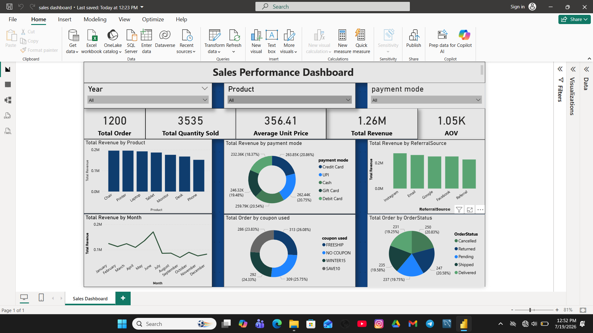

# 📊 Sales Data Analytics Project

## 📌 Project Overview
This project demonstrates an end-to-end Sales Data Analytics workflow using Microsoft Excel and Power BI. The objective was to clean and prepare raw sales data, perform exploratory data analysis (EDA), and build an interactive dashboard to uncover meaningful business insights.

---

## 🎯 Objectives
- Clean and prepare raw sales data
- Perform Exploratory Data Analysis (EDA)
- Calculate key business metrics
- Build an interactive Power BI dashboard
- Generate insights to support business decision-making

---

## 🛠️ Tools Used
- Microsoft Excel
- Power BI
- GitHub

---

## 📂 Dataset
The dataset contains sales transaction records including:
- Order ID
- Product
- Customer ID
- Quantity
- Unit Price
- Total Price
- Payment Mode
- Coupon Used
- Referral Source
- Order Status
- Date

---

## 🧹 Data Cleaning
- Removed duplicate records
- Checked missing values
- Standardized payment mode values
- Corrected inconsistent data
- Verified data types

---

## 📈 Dashboard Features
- Total Revenue
- Total Orders
- Total Quantity Sold
- Average Unit Price
- Average Order Value (AOV)
- Revenue by Product
- Revenue by Month
- Revenue by Payment Mode
- Revenue by Referral Source
- Orders by Coupon
- Orders by Status
- Interactive slicers

---

## 📷 Dashboard Preview

---

## 💡 Key Insights
- Identified top-performing products.
- Compared revenue across payment modes.
- Analyzed monthly sales trends.
- Evaluated coupon usage.
- Examined order status distribution.
- Measured Average Order Value (AOV).

---

## 📁 Project Files
- Cleaned Excel Dataset
- Raw Dataset
- Power BI Dashboard (.pbix)
- Dashboard Screenshot

---

## 🚀 Skills Demonstrated
- Data Cleaning
- Exploratory Data Analysis (EDA)
- Excel
- Power BI
- Data Visualization
- KPI Design
- Dashboard Development
